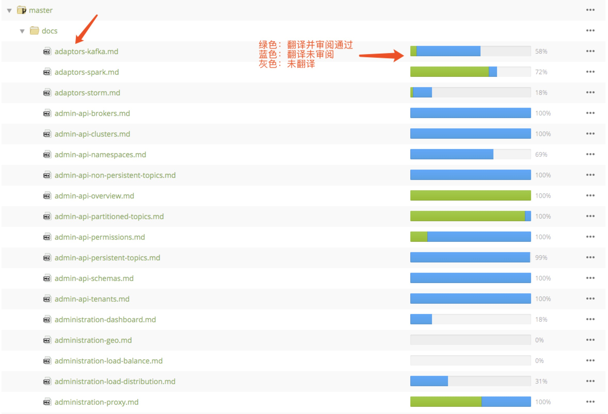
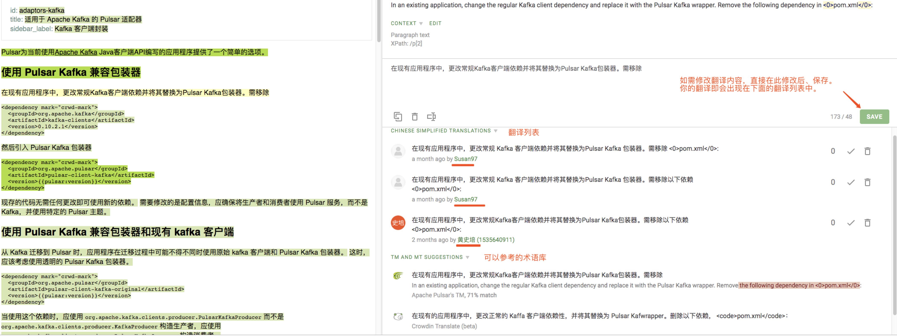

# 翻译流程和规范

欢迎加入 Pulsar 文档翻译项目！翻译前，阅读[翻译流程](#翻译流程)和[翻译规范](#翻译规范)会帮助你快速上手。

## 翻译流程
Pulsar 的翻译项目放在 [Apache Pulsar Crowdin](https://crowdin.com/project/apache-pulsar) 上。想进一步了解 Crowdin 功能，参阅 [Crowdin 网站](https://crowdin.com/) 。
我们的翻译流程主要有以下几步。

### 注册 Crowdin 账号，加入 Pulsar 翻译项目组
登录 [Apache Pulsar Crowdin project](https://crowdin.com/project/apache-pulsar) 页面。如果没有 Crowdin 账户，点击右上角 **SIGN UP**，输入个人信息创建账户。如果你已经有 Github、Facebook，Google，Twitter，Gitlab 账号，直接在注册页面关联以上任意账号即可。

登录成功后，在右上角选择 **Join（加入）**。
> 注意  
> Pulsar 的源文件为英文，翻译项目分为中文、法语和日语。  
> 选择翻译目标语言，点击进入浏览。本文以“简体中文翻译项目”为例。

### 选择翻译文件，提 PR
点开“简体中文翻译项目”，进入 **master > docs** 目录中，查看每个文件的翻译进度。 **master > docs** 目录中的文件是 Pulsar 官网最新版本的源文件，只需要翻译这个目录中的 markdown 文件即可。其中： 
   
- 绿色：翻译并通过审阅  
- 蓝色：翻译未审阅  
- 灰色：未翻译

根据自己对 Pulsar 及相关技术的理解，优先选择自己熟悉、尚未翻译的内容进行翻译。

选择要翻译的文件后，查看 [Translation schedule](https://github.com/streamnative/translation-guidelines/schedule) 中是否有其他人在翻译这个文件。如果已经有，可以重新选择；如果没有，参考 [PR 模版](https://github.com/streamnative/translation-guidelines/blob/master/.github/PULL_REQUEST_TEMPLATE.md)，把自己要翻译的文件和姓名分别添加进 [Translation schedule](https://github.com/streamnative/translation-guidelines/schedule)，提交 PR。

### 打标签
- Reviewers：无需设置，负责人会自动收到您提交的 PR 申请，会安排人员处理。
- Assignees：选择您自己，方便你后续收到进度通知。
- Label：选择 `translation`。

### 翻译
译者开始翻译。在打开的翻译界面，文件 id 不需要翻译。翻译中的 tag 和源文件保持一致。
> **重要  
> 一定不要修改、遗漏 tag，或者在 tag 后面加空格。tag 遗漏或错位会造成中文网站内容显示错乱。**

如果看到有翻译需要修改的地方，直接在翻译界面修改、保存。你的翻译结果会自动出现在翻译列表的最上方，Crowdin 会自动记载不同译者的翻译版本。右下方的 **TM AND MT TRANSLATION** 中会提供 Pulsar、Crowdin 和网站上其他的术语库，翻译时可供参考。

翻译过程中，如需参考或者追加 Pulsar 文档术语库，可以使用 [Pulsar 文档翻译术语库](https://shimo.im/sheets/5jozGy5WIUQQf5JV/MODOC)。

### 审阅
翻译完成后，在您提交的 PR 页面留言告知：  
“I've finished translation, could you please help review?”

Reviewer 收到通知后，开始审阅翻译内容。审阅完成后，在 PR 中告知译者，并做简单点评反馈。如有需要讨论的地方，可以直接在 PR 中交流讨论。 

审阅无误后，reviewer approve 该 PR，并 merge。

## 翻译规范 ##
本规范主要列出了一些常见的翻译问题，并提供了一些指导意见和建议。开始翻译前，请认真阅读并尽量遵守本文的规范，这能有效提高 Pulsar 翻译文件质量，统一翻译风格。

### 1. 专有名词

涉及到 Pulsar、Pulsar Functions、BookKeeper、ZooKeeper，按照上述大小写格式，保留英文不翻译。  
涉及到 broker，bookie，proxy 等，在句中保持英文小写形式，不用翻译。  
涉及到 topic，producer，consumer 等，翻译成“主题”，“生产者”，“消费者”。   

更多有关 Pulsar 文档术语库，参考 [Pulsar 文档翻译术语库](https://shimo.im/sheets/5jozGy5WIUQQf5JV/MODOC)。欢迎在这个文档补充和修改术语库。

### 2. 汉字与英文、数字之间需空格

汉字与英文或数字之间以空格隔开，以增强中英文混排的美观性和可读性。 
 
- Apache Pulsar是一个开源的分布式发布-订阅消息系统，由Apache软件基金会管理，并于2018年9月成为Apache顶级开源项目。❌ 

- Apache Pulsar 是一个开源的分布式发布-订阅消息系统，由 Apache 软件基金会管理，并于 2018 年 9 月成为 Apache 顶级开源项目。✅ 

**注意：**中文标点符号前后不需要跟空格，即使前后挨着的是英文单词。

###  3. 中文标点符号

中文里面请使用中文标点符号。英文中没有顿号，应该使用顿号的地方在英文中一般使用的是逗号，在翻译时应注意将其翻译为顿号。比如 “Kubernetes, Mesos, Docker“ 应该翻译成 “Kubernetes、Mesos、Docker“。

在涉及到多个 items 时，如果是短语，后面用分号（；）结束，最后一个 item 以句号（。）结尾。

如果每个 item 是个句子，或者已经使用过分号（；），每个 item 以句号结尾。

 

上面这个例子中，使用句号（。）给每条实践结尾。

### 4. “you“翻译为“你“

为了风格统一，在翻译“you”时，可以省略时，尽量省略不用；必须使用时，用“你”，而不是“您”。

### 5. 示例代码及注释

示例代码中的注释最好能够翻译，当然也可以不翻译（当注释很简单时）。

### 6. 意译优于直译

翻译时尽量避免翻译腔，即把原文一字不漏地、逐句翻译出来。这样并不代表翻译更准确，有时候读着会很别扭。翻译完后，自己多读几遍，看看是否符合原意、是否绕口、是否简洁。在充分理解原文的基础上，可以适当采用意译的方式来翻译。有时候为了简化句子，有些数量词、助词、主语都可以省略。

#### 6.1 ...的...的...的...

比如英文中经常会用 ‘s 来表达从属关系，一字不落地都将其翻译成 “的“ 会有翻译腔。在中文里面有些 “的“ 完全可以去掉，不会影响表达的意思，还能简洁很多，看下面的例子。

- Pulsar‘s documentation is located in the docs folder in Pulsar’s source code repository.

当然，你可以将“的“字都翻译出来，但是读起来很不顺畅：

- Pulsar 的文档位于 Pulsar 的源码仓库的 docs 文件夹中。 ❌ 

去掉不必要的“的“字，就会简洁很多：

- Pulsar 文档位于 Pulsar 源码仓库的 docs 文件夹中。 ✅ 

#### 6.2 一个……

英文一般比较严谨，当代表多个时，会使用复数名字，在翻译成中文时，一般不需要刻意把这些复数翻译出来。

在英文里，当单数为可数名词时，前面一般会有 ”a“ 或 ”an“；中文中，我们一般不需要把”一个...“翻译出来。比如下面这个例子：

- Using a Pulsar client with the proxy

我们可以把”a“翻译成”一个“：

- 使用有 proxy 的一个 Pulsar 客户端   ❌  

虽然看起来没什么问题，但是这里的”一个“是多余的，去掉之后不但不会影响翻译效果，而且更加简洁。

- 使用有 proxy 的 Pulsar 客户端   ✅ 

### 7. 尽量少用被动句

英文文档中，有时以物为主语，中文翻译过程中，不需要把”被“字翻译出来。例如：  

 - 英文：Once the message above has been successfully published to the topic, you should see it in the standard output: Hello Pulsar.
 - 原翻译：一旦上面的消息被成功发布到Topic中，您会在标准输出中看到它：Hello Pulsar”。   ❌
 - 翻译调整：上面的消息成功发布到主题后，你会在标准输出中看到: Hello Pulsar。    ✅ 

### 8. Will 将来时态
英文中有“will”时，不用翻译成“将要......”，直接转化成一般现在时翻译就行。例如：  

- This will publish a single message to the Pulsar topic. 
- 原翻译：这将向Pulsar的Topic发送单条消息。   ❌
- 翻译调整：（......）给 Pulsar 主题发布一条信息。   ✅ 

### 9. 示例
在英文中遇到 “Here‘s sth”，根据上下文语境做调整。例如： 

- Here's an example.
- 原翻译：这里有一个示例。   ❌
- 翻译调整：下面是一个示例。     ✅ 

### 10. 语言简洁、流畅
语言尽量简单、通顺，翻译完后，读一遍，适合中国人的阅读习惯。英语中有时会用从句，翻译中文时，尽量拆成几个简单的句子。

## 加入 Contributors
当你读完本篇内容，开始翻译 Pulsar 文档时，在 [Contributors](https://github.com/streamnative/translation-guidelines/blob/master/CONTRIBUTORS.md) 中加上自己的名字。 

## License
